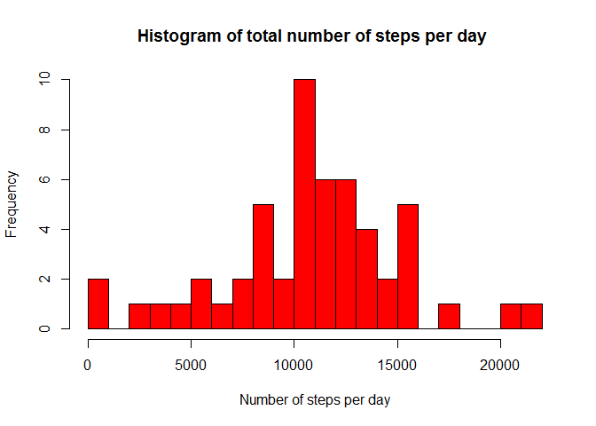
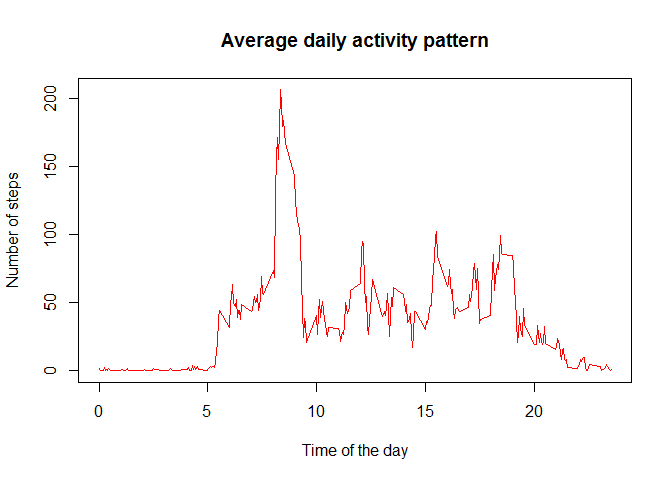
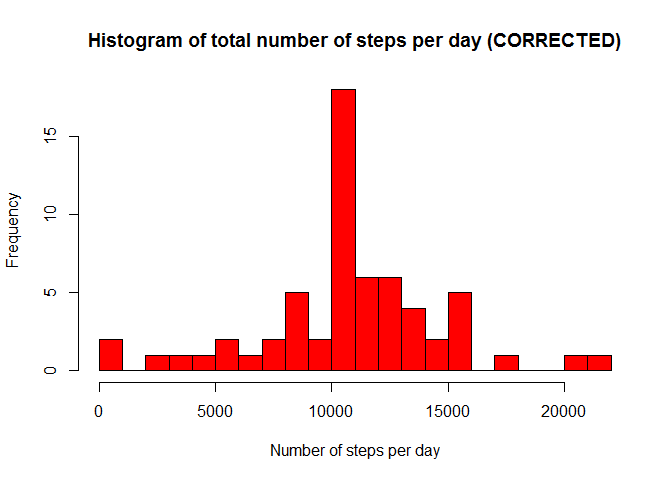
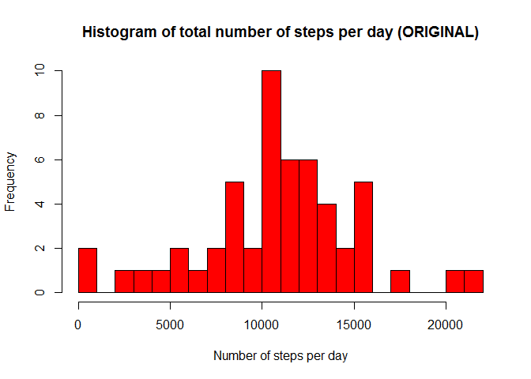
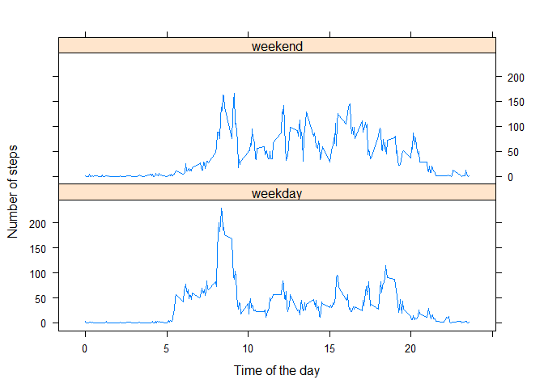

# Reproducible Research: Peer Assessment 1

## Loading and preprocessing the data

Load the data from the csv file 

```r
activity <- read.csv("activity.csv")
```

Convert the date variable to the date type

```r
activity[,2] <- as.Date(activity[,2], "%Y-%m-%d")
```

Convert the interval variable to the hour.min 

```r
activity[,3] <- activity[,3] %/% 100 + (activity[,3] %% 100) / 100
```


## What is mean total number of steps taken per day?

Let's ignore NA values for this part

```r
activity_no_na = na.omit(activity)
```

Load dplyr package and summarise activities for each day

```r
library(dplyr)
```

```
## 
## Attaching package: 'dplyr'
## 
## The following objects are masked from 'package:stats':
## 
##     filter, lag
## 
## The following objects are masked from 'package:base':
## 
##     intersect, setdiff, setequal, union
```

```r
activity_per_day <- summarise(group_by(activity_no_na, date), steps = sum(steps))
```

Calculate a **histogram** of total number of steps taken per day.

```r
hist(activity_per_day$steps, 30, col = "red", main = "Histogram of total number of steps per day ",
     xlab = "Number of steps per day")
```

 

Calculate the **mean** of steps taken per day

```r
mean_without_na <- mean(activity_per_day$steps)
mean_without_na
```

```
## [1] 10766.19
```

Calculate the **median** of steps taken per day

```r
median_without_na <- median(activity_per_day$steps)
median_without_na
```

```
## [1] 10765
```


## What is the average daily activity pattern?
Summorise the interval activities and calculate the mean for each interval.
Plot the average daily activity pattern.

```r
daily_pattern <- summarise(group_by(activity, interval), steps = mean(steps, na.rm = TRUE))
plot(daily_pattern$interval, daily_pattern$steps, type = 'l', col = "red", xlab = "Time of the day", 
     ylab = "Number of steps", main = "Average daily activity pattern")
```

 

Find the 5-min interval wich, on average, contains the **maximum number of steps**.

```r
daily_pattern[which.max(daily_pattern$steps), "interval"]
```

```
## Source: local data frame [1 x 1]
## 
##   interval
##      (dbl)
## 1     8.35
```

## Imputing missing values
Calculate **the total number of missing values** 

```r
nrow(activity[is.na(activity$steps),])
```

```
## [1] 2304
```

Correct the missing values with average value for this interval

```r
activity_corrected <- activity
for (i in 1:nrow(activity_corrected)) {
  if(is.na(activity_corrected[i, 'steps'])){
    activity_corrected[i, 'steps'] <- daily_pattern[daily_pattern$interval == activity_corrected[i, 'interval'], 'steps']
  }
}
```

Summarise activities for each day for corrected dataset

```r
library(dplyr)
activity_per_day_corrected <- summarise(group_by(activity_corrected, date), steps = sum(steps))
```

Calculate a **histogram** of total number of steps taken per day for corrected dataset.

```r
hist(activity_per_day_corrected$steps, 30, col = "red", main = "Histogram of total number of steps per day (CORRECTED)",
     xlab = "Number of steps per day")
```

 

Let's look again on the histogram without NA

```r
hist(activity_per_day$steps, 30, col = "red", main = "Histogram of total number of steps per day (ORIGINAL)",
     xlab = "Number of steps per day")
```

 

Calculate the **mean** of steps taken per day for corrected dataset

```r
mean_corrected <- mean(activity_per_day_corrected$steps)
```

Average withoun NA

```r
mean_without_na
```

```
## [1] 10766.19
```

Average with corrected NA

```r
mean_corrected
```

```
## [1] 10766.19
```

Calculate the **median** of steps taken per day for corrected dataset

```r
median_corrected <- median(activity_per_day_corrected$steps)
```

The median without na:

```r
median_without_na
```

```
## [1] 10765
```

The median with corrected na:

```r
median_without_na
```

```
## [1] 10765
```

As we can see, the values for the average and the median of total number of steps taken per day have not changed a lot.
The first one (average) stayed the same, the second (median) changed a little bit.


## Are there differences in activity patterns between weekdays and weekends?

Create a factor variable for the weekend.

```r
week_end = c ("Saturday", "Sunday")
activity_corrected$day <- ifelse(weekdays(activity_corrected$date) %in% week_end, 'weekend', 'weekday')
activity_corrected$day <- as.factor(activity_corrected$day)
```

Load lattice library and plot the patterns for the averaged weekend day vs. the averaged weekday.

```r
library(lattice)
pattern <- activity_corrected %>% group_by(day, interval)
pattern <- summarise(pattern, steps = mean(steps, na.rm = TRUE))
xyplot(pattern$steps ~ pattern$interval | pattern$day, layout = c(1,2), type = 'l', ylab = 'Number of steps', xlab = 'Time of the day')
```

 

As one can expect, the activity patterns for weekends and weekdays differ.  
For instance, on weekends people don't get up as early as on weekdays.

